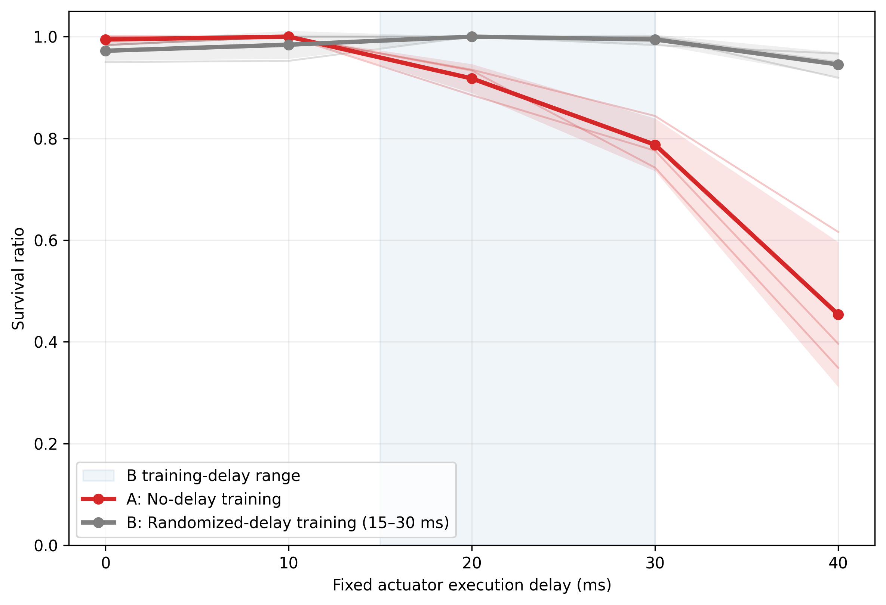
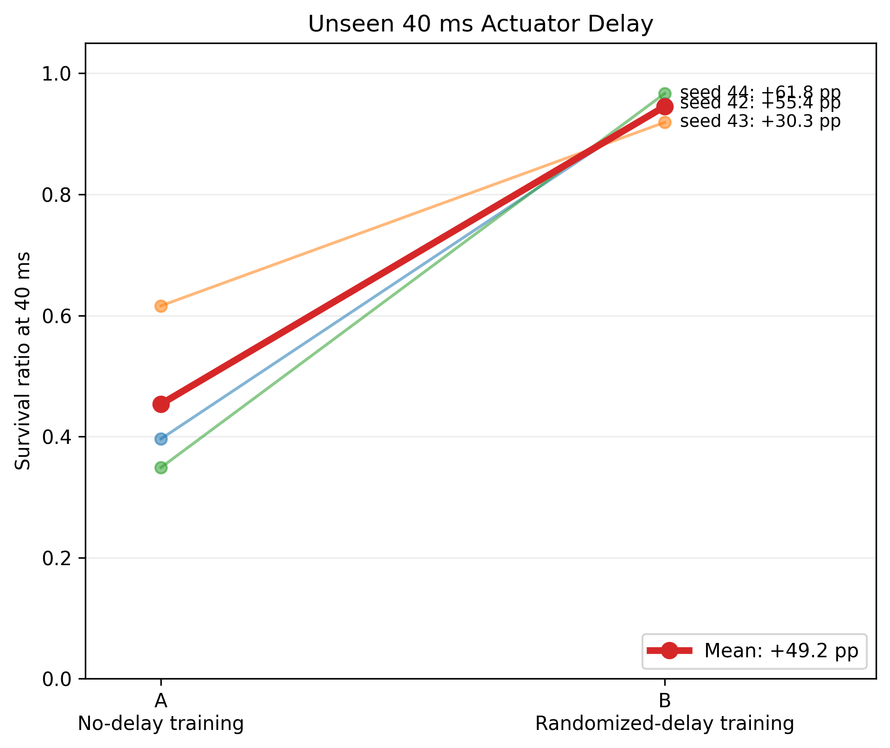
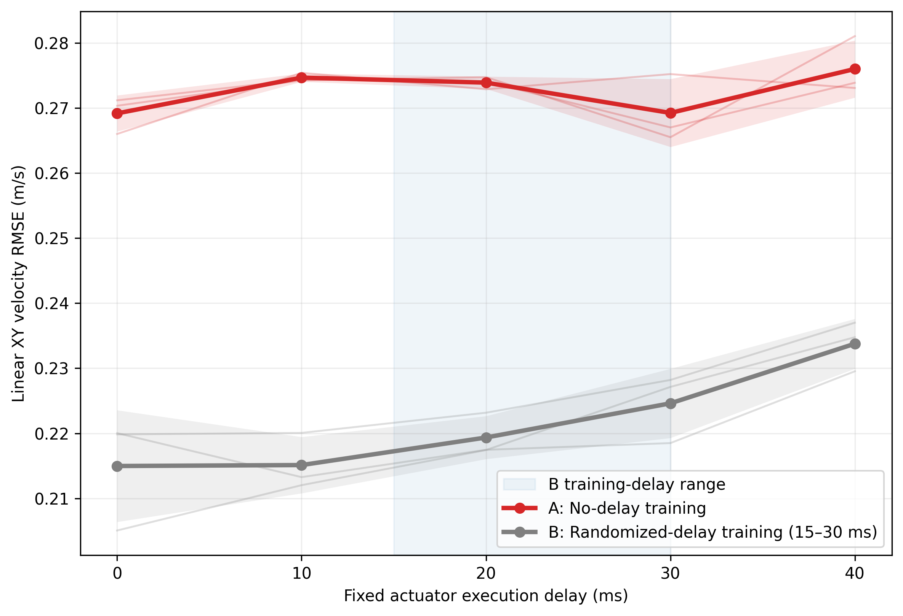
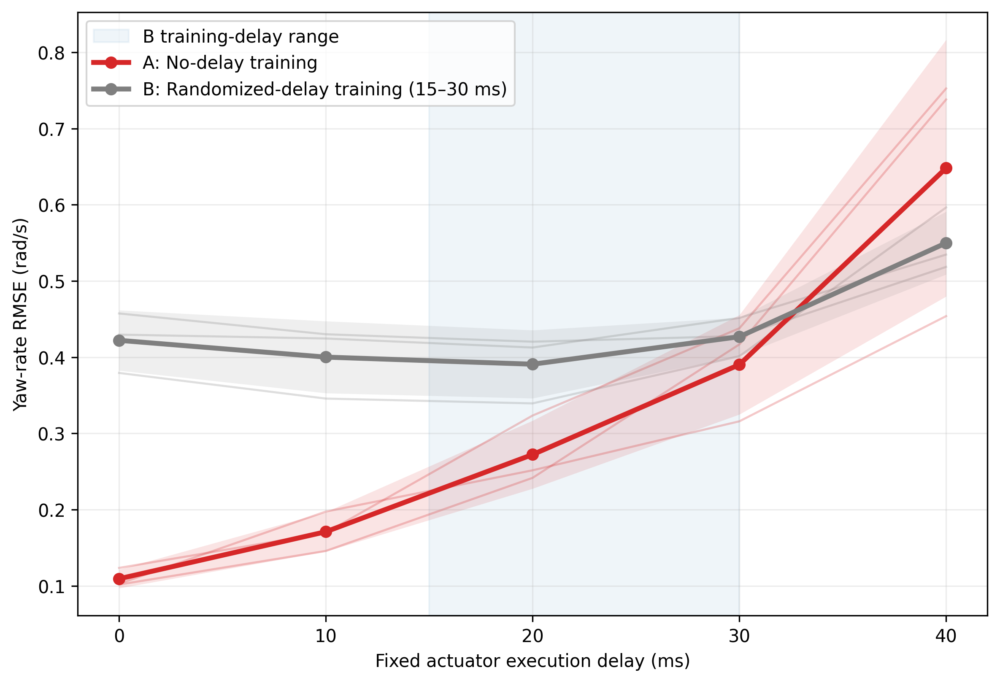

# Microduck Actuator-Delay Robustness: PPO Locomotion under Execution Latency

This project studies whether actuator-delay randomization during training improves the robustness of a learned Microduck locomotion policy to fixed execution latency.

## Key Result

Training PPO locomotion policies with randomized **15–30 ms actuator command delay** substantially improved survival robustness under increasing execution latency.

At an **out-of-training-range fixed delay of 40 ms**:

- **No-delay training:** 45.4% mean survival
- **Randomized-delay training:** 94.5% mean survival
- **Absolute difference:** +49.2 percentage points
- The survival improvement was observed across **all 3 independent training seeds**



> **Research question:** Does training with randomized actuator command latency improve robustness to unseen fixed execution delays?

Two PPO training conditions are compared:

- **A — No-delay training:** fixed actuator delay of 0 physics steps (0 ms).
- **B — Randomized-delay training:** actuator delay randomized between 3 and 6 physics steps (15–30 ms).

Both conditions use the same Microduck flat-terrain velocity task and the same training budget. Three independently trained policies are evaluated for each condition.

---

## Experimental Setup

### Environment

- Task: `Mjlab-Velocity-Flat-MicroDuck`
- Simulator: MuJoCo Warp
- Algorithm: PPO
- Physics timestep: 5 ms
- Control timestep: 20 ms
- Parallel training environments: 512
- Training iterations: 5,000
- Environment transitions per policy: 61.44 million
- Training seeds: 42, 43, 44

The policy receives proprioceptive observations and outputs 14 joint-position actions.

### Training Conditions

| Condition | Actuator delay during training |
|---|---|
| A — No-delay | 0 ms |
| B — Randomized-delay | 15–30 ms |

The delay represents latency between policy output and actuator command execution and is measured in physics simulation steps.

For condition B, actuator lag is dynamically randomized within 3–6 physics steps.

---

## Evaluation Protocol

Each trained policy is evaluated under fixed actuator execution delays:

| Physics steps | Delay |
|---:|---:|
| 0 | 0 ms |
| 2 | 10 ms |
| 4 | 20 ms |
| 6 | 30 ms |
| 8 | 40 ms |

The 40 ms condition lies outside the randomized 15–30 ms training-delay range and is therefore used as an out-of-range robustness test.

For every trained policy and delay condition, evaluation is repeated with three evaluation seeds.

- Training conditions: 2
- Training seeds per condition: 3
- Fixed delays: 5
- Evaluation seeds: 3

This gives a total of:

**2 × 3 × 5 × 3 = 90 evaluation runs**

The commanded velocity is fixed at:

- `vx = 0.3 m/s`
- `vy = 0.0 m/s`
- `wz = 0.0 rad/s`

Primary metrics are:

- Survival ratio
- Linear XY velocity RMSE
- Forward velocity RMSE
- Lateral velocity RMSE
- Yaw-rate RMSE

Evaluation-seed results are first averaged within each independently trained policy. Reported means and standard deviations are then computed across the three independent training seeds.

---

# Results

## 1. Survival Robustness


Policies trained without actuator delay perform reliably at low latency but degrade substantially as execution delay increases.

In contrast, policies trained with randomized 15–30 ms actuator delay maintain high survival across the evaluated delay range.

| Delay | No-delay training | Randomized-delay training |
|---:|---:|---:|
| 0 ms | 0.994 ± 0.010 | 0.972 ± 0.019 |
| 10 ms | 1.000 ± 0.000 | 0.984 ± 0.028 |
| 20 ms | 0.918 ± 0.028 | 1.000 ± 0.000 |
| 30 ms | 0.787 ± 0.052 | 0.994 ± 0.010 |
| 40 ms | 0.454 ± 0.143 | 0.945 ± 0.024 |

Values are mean ± SD across three independent training seeds.

The largest difference occurs at the unseen 40 ms delay:

**45.4% → 94.5% survival**

This corresponds to an absolute difference of approximately:

**+49.2 percentage points**

## 2. Unseen 40 ms Delay



The survival improvement at 40 ms is observed for all three independent training seeds:

| Training seed | No-delay | Randomized-delay | Difference |
|---:|---:|---:|---:|
| 42 | 0.396 | 0.950 | +55.4 pp |
| 43 | 0.616 | 0.919 | +30.3 pp |
| 44 | 0.349 | 0.967 | +61.8 pp |

The mean survival difference at 40 ms is **+49.2 percentage points**.

The direction of the survival difference is consistent across all three independent training seeds, rather than being driven by a single training run.

## 3. Linear Velocity Tracking



Randomized-delay policies show lower linear XY velocity RMSE across the evaluated delay conditions.

At the unseen 40 ms delay, the difference is consistent across all three training seeds:

| Training seed | No-delay RMSE | Randomized-delay RMSE | Difference |
|---:|---:|---:|---:|
| 42 | 0.281 | 0.235 | -0.046 m/s |
| 43 | 0.273 | 0.237 | -0.036 m/s |
| 44 | 0.274 | 0.230 | -0.044 m/s |

The mean difference at 40 ms is approximately **-0.042 m/s**.

An important observation is that velocity RMSE alone does not fully capture locomotion robustness. The no-delay policies show relatively stable aggregate XY RMSE as execution delay increases, even while their survival ratio deteriorates substantially.

For this reason, tracking metrics should be interpreted jointly with survival.

## 4. Yaw Tracking



Yaw-rate tracking reveals a different trade-off.

No-delay policies achieve substantially lower yaw-rate RMSE under nominal low-delay conditions, but their error increases rapidly as actuator delay grows.

Randomized-delay policies have worse nominal yaw tracking but are less sensitive to increasing execution latency on average.

At 40 ms, however, the paired yaw-rate differences are not consistent across training seeds. Seeds 42 and 44 favor randomized-delay training, while seed 43 favors no-delay training.

Therefore, this experiment does not show a consistent randomized-delay advantage for yaw-rate tracking.

---

# Discussion

Across three independently trained seeds, actuator-delay randomization substantially improves survival robustness under fixed execution delays in this Microduck locomotion experiment.

The strongest effect appears at higher latency. Policies trained without actuator delay remain reliable at low latency but become increasingly unstable beyond 20 ms. In contrast, randomized-delay policies maintain near-perfect mean survival through 30 ms and retain high survival at the unseen 40 ms condition.

At 40 ms, mean survival increases from **45.4% to 94.5%**, corresponding to a **+49.2 percentage-point difference**. Importantly, the direction of this difference is observed across all three independent training seeds.

Linear velocity tracking provides additional evidence of high-delay robustness. At 40 ms, randomized-delay policies achieve lower XY velocity RMSE for all three training seeds.

The yaw-rate results reveal an important trade-off. No-delay policies achieve substantially better nominal yaw tracking, whereas randomized-delay policies are less sensitive to increasing latency on average. However, the relative yaw performance at 40 ms varies across training seeds.

These observations suggest that actuator-delay randomization may change the control behavior learned by the policy rather than simply making an otherwise identical controller more tolerant to delay. Establishing the mechanism would require additional analysis of gait, joint trajectories, actions, contacts, and policy behavior.

Overall, the experiment supports the narrower conclusion that, under this controlled Microduck locomotion setup, randomized actuator-delay training improves survival robustness to execution latency, including the tested 40 ms delay outside the training-delay range.

---

# Limitations

This experiment has several important limitations:

1. Only three independent training seeds are used per training condition.
2. The experiment evaluates a single robot morphology and a single flat-terrain locomotion task.
3. The primary evaluation uses a fixed forward command of `vx = 0.3 m/s`.
4. The 40 ms condition represents a limited extrapolation beyond the 15–30 ms randomized training range.
5. All results are obtained in simulation and have not been validated on physical Microduck hardware.
6. The study isolates actuator command execution delay. It does not evaluate observation latency, communication latency, sensor noise, or all sources of real-world control delay.
7. Velocity tracking RMSE includes startup and reset transients and should therefore be interpreted jointly with survival metrics.
8. Evaluation randomization remains active during evaluation. Common evaluation seeds are used across conditions to make comparisons more controlled.

Accordingly, these results should be interpreted as a controlled actuator-delay robustness study rather than evidence that delay randomization universally improves sim-to-real locomotion.

---

# Reproducibility

## Repository Reference

Experiments were conducted from the Microduck RL repository on the `develop` branch using the following reference commit:

```text
cb70b79
```

The repository state should be fixed before reproducing the experiments rather than updated during an experimental run.

## Environment

The experiments were run under WSL2 Ubuntu with an NVIDIA RTX 5060 8 GB GPU.

The Python environment was installed using `uv`.

Install the locked environment with:

```bash
uv sync --locked
```

Verify the available environments with:

```bash
uv run list-envs
```

The target environment is:

```text
Mjlab-Velocity-Flat-MicroDuck
```

## Training

Both conditions use:

- 512 parallel environments
- 5,000 PPO iterations
- 61.44 million environment transitions per trained policy
- Training seeds 42, 43, and 44

Training is launched through:

```text
scripts/train_delay_ab.sh
```

For example, train condition A with seed 42:

```bash
./scripts/train_delay_ab.sh A 42
```

Train condition B with seed 42:

```bash
./scripts/train_delay_ab.sh B 42
```

Repeat both conditions for training seeds 42, 43, and 44.

Condition A explicitly uses:

```text
0–0 physics steps
```

Condition B explicitly uses:

```text
3–6 physics steps
```

Since one physics step is 5 ms, condition B corresponds to randomized actuator execution latency of 15–30 ms.

## Checkpoint Manifest

The six trained policies are recorded in:

```text
results/checkpoint_manifest.csv
```

The manifest maps each training condition and training seed to its corresponding checkpoint and is used as the source of truth for evaluation.

Trained checkpoints are not included in the repository due to file size. They can be regenerated using the provided training scripts and training seeds.

## Fixed-Delay Evaluation

The frozen evaluation protocol is implemented in:

```text
scripts/evaluate_delay_v05.py
```

A single fixed-delay evaluation can be run with:

```bash
uv run python scripts/evaluate_delay_v05.py \
  --checkpoint PATH_TO_CHECKPOINT \
  --lag 8 \
  --seed 0
```

The `--lag` argument is specified in physics steps:

| `--lag` | Execution delay |
|---:|---:|
| 0 | 0 ms |
| 2 | 10 ms |
| 4 | 20 ms |
| 6 | 30 ms |
| 8 | 40 ms |

The evaluator uses a fixed velocity command:

```text
vx = 0.3 m/s
vy = 0.0 m/s
wz = 0.0 rad/s
```

The complete evaluation sweep is launched with:

```bash
./scripts/run_full_delay_sweep.sh
```

The sweep evaluates:

```text
2 training conditions
× 3 independent training seeds
× 5 fixed delays
× 3 evaluation seeds
= 90 evaluation runs
```

Successful evaluations receive `.done` markers, allowing an interrupted sweep to resume without repeating completed runs.

## Parsing

Parse the evaluation logs with:

```bash
uv run python scripts/parse_full_delay_sweep.py
```

This produces:

```text
results/full_delay_results.csv
```

Each row represents one evaluation configuration and records the training condition, training seed, evaluation seed, delay, survival statistics, and physical velocity-tracking metrics.

## Multi-Seed Analysis

Aggregate the results with:

```bash
uv run --with pandas python scripts/analyze_full_delay_results.py
```

This produces:

```text
results/policy_delay_results.csv
results/multiseed_delay_summary.csv
```

The analysis uses the following statistical hierarchy:

```text
90 evaluation runs
        |
        v
average 3 evaluation seeds
within each trained policy and delay
        |
        v
30 policy-delay observations
        |
        v
aggregate 3 independent training seeds
for each method and delay
        |
        v
10 method-delay summary points
```

Training seed, rather than evaluation seed, is treated as the independent replication unit.

For the primary 40 ms comparison, paired descriptive analysis across common training-seed labels is implemented in:

```text
scripts/analyze_paired_40ms.py
```

With only three independent training seeds per condition, the analysis emphasizes raw seed-level results, mean, and sample standard deviation rather than relying on inferential significance testing.

## Figures

Generate the main multi-seed figures with:

```bash
uv run --with pandas --with matplotlib \
  python scripts/plot_multiseed_delay_results.py
```

Generate the paired 40 ms survival figure with:

```bash
uv run --with pandas --with matplotlib \
  python scripts/plot_paired_40ms.py
```

The main outputs are:

```text
results/final_survival_vs_latency.png
results/final_xy_rmse_vs_latency.png
results/final_yaw_rmse_vs_latency.png
results/final_paired_survival_40ms.png
```

---

# Project Status

- [x] CUDA / MuJoCo Warp environment validated
- [x] Compute-adapted baseline locomotion training completed
- [x] Fixed actuator-delay evaluator implemented and frozen
- [x] No-delay training completed for three independent seeds
- [x] Randomized-delay training completed for three independent seeds
- [x] 90-run fixed-delay evaluation sweep completed
- [x] Evaluation results parsed and validated
- [x] Multi-training-seed analysis completed
- [x] Paired 40 ms analysis completed
- [x] Final robustness figures generated
- [x] Reproduction pipeline documented
- [ ] Technical report
- [ ] Broader command-distribution evaluation
- [ ] Physical robot validation

---

# Summary

Under the controlled Microduck locomotion setup used in this study, randomized actuator-delay training substantially improves survival robustness as execution latency increases.

At the tested 40 ms delay outside the 15–30 ms randomized training range, mean survival across three independently trained policies increases from **45.4% to 94.5%**, corresponding to a **+49.2 percentage-point difference**. The direction of the survival improvement is reproduced across all three training seeds.

The experiment also shows why robustness should not be characterized using a single tracking metric. Survival, linear velocity tracking, and yaw-rate tracking respond differently to increasing actuator latency. In particular, randomized-delay training improves high-delay survival while exhibiting a trade-off in nominal yaw-rate tracking.

These results motivate further investigation under broader command distributions, additional latency sources, and eventually physical robot experiments.
